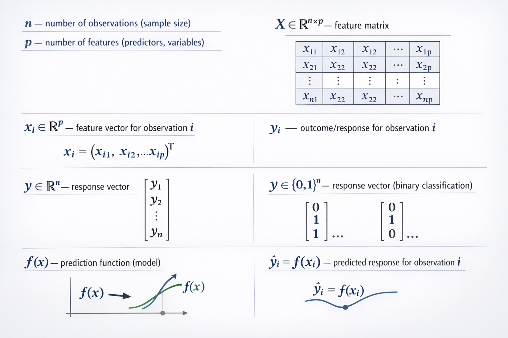
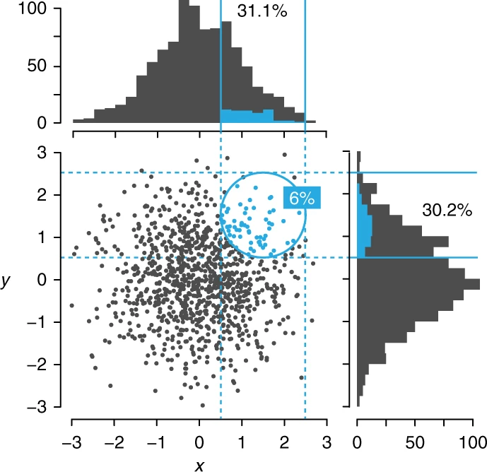
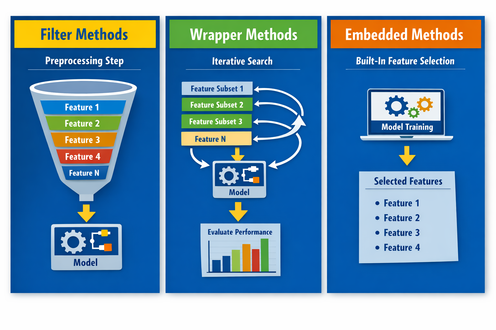

```{=html}
<style>
.tall-slide {
  height: 1200px !important;
}
</style>
```

```{r, echo=F}
library(dplyr)
library(ggplot2)
library(glmnet)
```

## Materials

https://github.com/solonkarapa/Feature-Selection/

{width="100%"}

> Copyright © 2026 Solon Karapanagiotis -- This presentation and its contents may not be shared, copied, or redistributed without permission.

## Introduction

-  Modern datasets often contain
    - Hundreds to millions of features
    - Redundant or irrelevant features
    - Noisy measurements
-   Key question: Should we care?

## Learning Outcomes

By the end of the session, students will be able to:

-   Explain why feature selection is important.
-   Distinguish between different feature selection methods.
-   Understand pros and cons of the different methods.
-   Apply common feature selection techniques.

## Notation {.smaller}

:::::: columns
:::: nonincremental
::: column
-   $n$ — number of observations (sample size)
-   $p$ — number of features (predictors, variables)
-   $X ∈ ℝ^{n × p}$ — feature matrix
-   $x_i ∈ ℝ^p$ — feature vector for observation $i$
-   $y_i$ — outcome/response for observation $i$
-   $y \in ℝ^n$ — response vector (regression)
-   $y \in \{0,1\}^n$ — response vector (binary classification)
-   $f(x)$ — prediction function (model)
-   $\hat{y}_i = f(x_i)$ — predicted response for observation $i$
:::
::::

::: column
{width="100%"}
:::
::::::

## Definition

A common definition is

> Feature selection is the process of selecting a subset of (relevant) features (covariates, predictors) from a dataset to use in model construction. - adapted from [wikipedia](https://en.wikipedia.org/wiki/Feature_selection).

::: fragment
> Feature selection is the process of selecting a subset of the features that has the best predictive ability.
:::

::: fragment
> ... and is interpretable.
:::

## Feature selection vs Feature extraction

-   Feature extraction creates new features from functions of the original features, whereas feature selection finds a subset of the features.

-   Feature selection maintains the meaning of the features and gives models better interpretability.

-   Feature extraction = create new features from data (e.g. PCA)

-   Feature selection = choose a subset of existing features

## What is Feature Selection?

the process of selecting a subset of features that:

1.  maximizes predictive ability, and
2.  enhances interpretability.

## Why Feature Selection?

Two main problems:

1.  High dimensionality. As the number of features increases, the amount of data (ie sample size, $n$) required to train reliable models also increases. This phenomenon is closely related to what is known as the [curse of dimensionality](https://en.wikipedia.org/wiki/Curse_of_dimensionality), where learning/estimating becomes harder because the data becomes sparse in high-dimensional space.

## Intuition

::::: columns
::: column

:::

::: column
Among 1,000 (x, y) points in which both x and y are normally distributed with a mean=0 and s.d = 1, only 6% fall within 1 of (x, y) = (1.5, 1.5) (blue circle). However, when the data are projected into a lower dimension—shown by histograms—about 30% of the points (all bins within blue solid lines) are within 1 of 1.5. Blue bins in histograms correspond to the blue points.

[Altman and Krzywinski, Nat Methods (2018)](https://doi.org/10.1038/s41592-018-0019-x)
:::
:::::

## Illustration 1

::::: columns
::: column
```{r, echo=F}
load("/Users/solon/Cloud-Drive/Teaching/MPhil_Data_Science/Applied_ML/feature_selection/data/sims1.Rdata")

results %>% 
    filter(n_irrelevant == 0) %>%
    ggplot(., aes(x = n_train, y = RMSE, color = model)) +
    geom_line(linewidth = 1) + 
    geom_point() +
    labs(x = "Sample Size",
         y = "Test RMSE",
         color = "Model",
         title = "Effect of increasing p/n ratio") +
    theme_minimal()
```
:::

::: column
Simulation setting

-   training sample size ($n$) = 500, 1000, 2000, 5000
-   test sample size = 10000
-   $p$ = 20
-   $\text{RMSE} = \sqrt{ \frac{1}{n_{test}} \sum_{i=1}^{n_{test}} \left( y_i - \hat{y}_i \right)^2 }$

For details see Practical 1.
:::
:::::

## Why Feature Selection?

Two main problems:

1.  High dimensionality.

2.  Model intepretability. It is often the case that some or many of the features are not associated with the outcome. Including such irrelevant (or redundant) features leads to unnecessary loss of performance. Further, by removing these features—that is, by setting the corresponding coefficient estimates to zero—we can obtain a model that is more easily interpreted.

## Illustration 2

::::: columns
::: column
```{r, echo=F}
ggplot(results, aes(x = n_irrelevant, y = RMSE, color = model)) +
    geom_line(size = 1) +
    geom_point() +
    facet_wrap(~ n_train, scales = "free_y") +
    labs(x = "Number of Irrelevant Features",
         y = "Test RMSE",
         color = "Model",
         title = "Effect of Irrelevant Features") +
    theme_minimal()
```
:::

::: column
Simulation setting

-   same as before
-   adding irrelevant features
:::
:::::

## Goals of feature selection

-   In practice, we often desire to have a model that has the best predictive ability and is interpretable.
-   Often a trade-off between predictive performance and interpretability.
-   That is, generally not possible to maximize both at the same time - *Shmueli 2010, Statistical Science*
-   The goal of feature selection will be re-framed to:

::: fragment
> Reduce the number of features as far as possible without compromising predictive performance.
:::

##  {.center}

> Practical 1

https://github.com/solonkarapa/Feature-Selection/

{width="100%"}

## Feature Selection Methods Overview

A feature selection method (algorithm or strategy) can be seen as the combination of a search technique for proposing new feature subsets, along with an evaluation measure which scores the different feature subsets.

There are three main families of methods:

1.  Filter methods
2.  Wrapper methods
3.  Embedded methods

## Filter methods

*Key idea*: conduct an initial supervised analysis of the features to determine which are (most) important and then only provide these to the model. Rely on statistical relationships between features and the outcome.

A few examples are:

-   Correlation Coefficient
-   Odds-ratio and Chi-Square Test - used for categorical features (e.g. [epitools::oddsratio()](https://cran.r-project.org/web/packages/epitools/index.html))
-   Mutual Information - measures dependency between features and outcome (e.g. [FSelectorRcpp](https://cran.r-project.org/web/packages/FSelectorRcpp/index.html))
-   ...

## Filter methods

-   When the outcome is categorical, the relationship between the feature and outcome forms a contingency table.

-   When there are exactly two classes for the feature, the odds-ratio (OR) is a choice.

-   OR calculation:

$$ OR = \frac{\frac{a}{b}}{\frac{c}{d}} = \frac{a d}{b c}$$

```{r, echo=F}
data_matrix <- matrix(
  c("a", "b",
    "c", "d"),
  nrow = 2,
  byrow = TRUE
)

# Add labels
rownames(data_matrix) <- c("Smoker", "Non-Smoker")
colnames(data_matrix) <- c("Disease", "No Disease")

data_matrix
```

## Filter methods

::::: columns
::: column
```{r, echo=F}
set.seed(1)

# the sample size
n <- 300

# simulate feature 
Smoking <- sample(c("Non-smoker","Smoker"), n, replace = TRUE, prob = c(.55,.45))

# make smoking strongly related to disease
Disease <- ifelse(
    Smoking=="Smoker",
    rbinom(n,1,.60),   # higher risk
    rbinom(n,1,.25)    # lower risk
)

Disease <- factor(ifelse(Disease == 1, "Yes", "No"))

df <- data.frame(Smoking, Disease)

# Build contingency table
tab <- table(df$Smoking, df$Disease)
cat("Contingency table - counts")
tab

#cat("contingency table - proportions")
#prop.table(tab, 1)   # row proportions

# Compute Odds Ratio
#install.packages("epitools")  # run once
library(epitools)

or_res <- oddsratio(tab, method = "wald")
odds_ratio <- or_res$measure[2,1]
cat("OR =", odds_ratio)
```

Interpretation:

OR = 1 → no association

OR \> 1 → smoking increases odds of disease

OR \< 1 → protective effect
:::

::: column
```{r}
# Build the illustration figure
ggplot(df, aes(x = Smoking, fill = Disease)) +
    geom_bar(position="fill", width=.7) +
    theme_minimal(base_size = 14) +
    labs(
        title="Categorical feature vs categorical outcome",
        subtitle=paste(
            "Odds Ratio =", round(odds_ratio,2)
        ),
        y="Proportion with / without disease"
    )
```
:::
:::::

## Filter methods

::::: columns
::: column
-   When the outcome is numeric, and the categorical feature has two levels, then a basic t-test (`t.test()`) can be used to generate a statistic.

```{r}
set.seed(1)
# continuous predictor: smoking exposure
SmokingExposure <- rnorm(n, mean = 10, sd = 6)

# make higher exposure increase disease risk
prob_disease <- plogis(-2 + 0.18 * SmokingExposure)
Disease <- rbinom(n, 1, prob_disease)
Disease <- factor(ifelse(Disease == 1, "Yes", "No"))

df <- data.frame(SmokingExposure, Disease)

# two-sample t-test 
t_res <- t.test(SmokingExposure ~ Disease, data = df)
t_res

#p_val <- t_res$p.value
#means <- tapply(df$SmokingExposure, df$Disease, mean)
#means
```
:::

::: column
```{r}
ggplot(df, aes(x = Disease, y = SmokingExposure, fill = Disease)) +
    geom_boxplot(width=.2, outlier.shape=NA, alpha=.6) +
    theme_minimal(base_size = 14) +
    labs(title = "Continuous predictor vs categorical outcome",
         subtitle = paste("t-test ", round(t_res$statistic, 3)),
         y = "Smoking exposure (pack-years)"
    )
```
:::
:::::

## Filter methods

Which statistical test or evaluation approach is appropriate in each of the following situations, and briefly explain why:

-   The outcome variable is numeric and the feature is a categorical with more than two levels.
-   Example:
    -   Outcome (numeric): Final exam score (0–100)
    -   Feature (categorical with \>2 levels): Teaching method used in the course
        -   Method A: Traditional lectures
        -   Method B: Flipped classroom
        -   Method C: Online learning

## Filter methods {.smaller}

Pros:

-   Fast and scalable.
-   Can be effective at capturing the large trends (i.e., individual feature-outcome relationship) in the data.

Cons:

-   Ignores feature interactions.
-   Ignores feature redundancy (potentially). Redundant (i.e., highly-correlated) features may be selected.
-   There may be a disconnect between the objective function for the filter method (e.g., significance) and what the model requires (predictive performance). In other words, a selection of features that meets a filtering criteria like statistical significance may not be a set that improves predictive performance.

## Wrapper methods

*Key idea*: Evaluate subsets of features by training a model. They use iterative search procedures that repeatedly supply feature subsets to the model and then use the resulting model performance estimate to guide the selection of the next subset to evaluate.

In practice, need to define:

1.  how to search the space of all possible feature subsets;
2.  how to assess the prediction performance of a model to guide the search and halt it;
3.  and which feature(s) to use.

## Wrapper methods

Examples:

-   Stepwise (forward, backward) selection (eg `stats::step()`)
-   Recursive Feature Elimination (RFE)
-   ...

## Forward Selection

::::: columns
::: column
```{r}
# Install package if needed
# install.packages("DiagrammeR")
library(DiagrammeR)

grViz("
digraph forward_selection {
  
  node [shape=box, style=filled, color=lightblue, fontname=Helvetica]
  
  start [label='Start: Null Model\n(no features)']
  step1 [label='Step 1:\nFit models with each feature individually']
  select1 [label='Select feature with best AIC (or other criterion), add to model']
  step2 [label='Step 2:\nRefit model with selected features + each remaining candidate']
  check [label='Check entry criterion:\nAdd features if AIC is improved']
  repeat [label='Repeat until no predictors can enter']
  end [label='Result:\nFinal subset of predictors']
  
  start -> step1 -> select1 -> step2 -> check -> repeat -> end
}
")
```
:::

::: column
Akaike information criterion (AIC) is an estimator of prediction error:

$$ \mathrm {AIC} \,=\,2k-2\ln({\hat {L}})$$

k is the number of estimated parameters in the model, and $\hat{L}$ is the maximized value of the likelihood function for the model.

Thus, AIC rewards goodness of fit (as assessed by the likelihood function), but it also includes a penalty that is an increasing function of the number of estimated parameters.
:::
:::::

## Forward Selection

Using `step()`:

```{r}
# Create synthetic data
set.seed(123)
n <- 200

df <- data.frame(
    x1 = rnorm(n),   # strong signal
    x2 = rnorm(n),   # moderate signal
    x3 = rnorm(n),   # weak signal
    x4 = rnorm(n),   # noise
    x5 = rnorm(n)    # noise
)

# True outcome depends only on x1 and x2
df$y <- 3*df$x1 + 
    1.5*df$x2 + 
    0.3*df$x3 + 
    1*(df$x2 * df$x3) +   # <-- interaction added
    rnorm(n, sd = 2)

###############
###############
###############
# Fit models
null_model <- lm(y ~ 1, data = df)
full_model <- lm(y ~ ., data = df)

step_model <- step(
    null_model,
    scope = list(lower = null_model, upper = full_model),
    direction = "forward",
    k = 2,      # AIC
    trace = TRUE
)

summary(step_model)

step_summary <- step_model$anova
# Add Step number column
step_summary$StepNumber <- 0:(nrow(step_summary)-1)

# Create feature label column
step_summary$Feature <- rownames(step_summary)
```

## Forward Selection

```{r}
ggplot(step_summary, aes(x=StepNumber, y=AIC)) +
    geom_point() +
    geom_point(size = 3) +
    theme_minimal(base_size = 14) +
    labs(
        title = "Forward Stepwise Regression Path",
        subtitle = "AIC decreases as useful features enter",
        x = "Step",
        y = "AIC"
    )
```

## Wrapper methods

Pros:

-   Capture feature interactions.
-   Potential to find the globally best feature subset (if it exists).

Cons:

-   Computationally expensive.
-   Risk of overfitting.

## Embedded methods

*Key idea*: Feature selection happens during model training. In this case, the model itself decides which features are important.

A few examples are:

-   LASSO (L1 regularization)
-   Elastic Net
-   Decision Trees
-   Random Forest / Gradient Boosting
-   ...

## Embedded methods - Linear regression {.smaller}

Linear regression seeks to find the coefficients $\beta_1, \ldots, \beta_p$ that minimize the sum of the squared distances (or error) from the estimated prediction of the samples to the observed values of the samples:

$$ SSE = \sum^n_{i=1}(y_i - \hat{y}_i)^2$$ $$ \hat{y}_i = \hat{\beta}_1 x_1 + \hat{\beta}_2 x_2 + \ldots + \hat{\beta}_p x_p$$

Problems:

-   If there are more features than samples or if one feature can be written as a combination of one or more of the other features.
-   As the features become more correlated with each other, the estimated regression coefficients get larger (inflate) and become unstable.

## Embedded methods - The LASSO

Instead minimise:

$$ SSE_{lasso} = \sum^n_{i=1}(y_i - \hat{y}_i)^2 + \lambda \sum^p_{j=1} |\beta_j|$$

-   This is the least absolute shrinkage and selection operator (lasso).
-   As the regression coefficients grow large, the penalty must also increase to enforce the minimization.
-   By having the penalization term, the lasso forces regression coefficients to become smaller and shrink to zero.
-   In doing so, the lasso practically selects model terms down to an optimal subset of features.

## Embedded methods - The LASSO

Dataset with 5 features.

This shows how coefficients shrink toward zero as penalty increases.

```{r}
set.seed(123)
n <- 200

df <- data.frame(
    x1 = rnorm(n),   # strong signal
    x2 = rnorm(n),   # moderate signal
    x3 = rnorm(n),   # weak signal
    x4 = rnorm(n),   # noise
    x5 = rnorm(n)    # noise
)

# True outcome depends only on x1 and x2
df$y <- 3*df$x1 + 
    1.5*df$x2 + 
    0.3*df$x3 + 
    1*(df$x2 * df$x3) +   # <-- interaction added
    rnorm(n, sd = 2)

x <- model.matrix(y ~ x1 + x2 + x3 + x4 + x5, data = df)[,-1]
y <- df$y

lasso_fit <- glmnet(x, y)

# This shows how coefficients shrink toward zero as penalty increases.
plot(lasso_fit, xvar = "lambda")
```

## Embedded methods - The LASSO

(Mean-squared (prediction)) error using 10-fold cross-validation:

```{r}
set.seed(123)

cv_lasso <- cv.glmnet(x, y)
plot(cv_lasso)

coef(cv_lasso, s = "lambda.1se")
```

## Embedded methods

Pros:

-   Good balance of speed and accuracy.
-   Incorporates feature interactions.
-   Provide a direct connection between selecting features and the objective function.

Cons:

-   Model-dependent. 

## Summary Methods {.center}

{fig-align="center"}

##  {.center}

> Practical 2

## Overfitting to Features

Overfitting

-   finding tuning parameter values that over-learn the relationship between the features and the outcome in the training set.
-   When models over-interpret patterns in the training set, the predictive performance suffers with new data.
-   Solution: evaluate the tuning parameters on a dataset that is not used to estimate the model parameters (via validation or assessment sets).
-   An analogous problem can occur when performing feature selection (*Overfitting to Features*).
    -   For many datasets it is possible to find a subset of features that has good predictive performance on the training set but has poor performance when used on a new dataset.

## Overfitting to Features {.smaller}

::::: columns
::: {.column width="40%"}
Suppose a model has five features (A–E), each with an importance score derived from the training set (A = most important, E = least important). Using **backward selection**:

-   Model 1 → uses all five features\
-   Model 2 → removes the least important features (E)\
-   And so on.
:::

::: column
1.  Rank features using the training set.
2.  For feature subset sizes from **5 down to 1**:
    1.  For each resample:
        -   Fit the model using the feature subset on the **analysis set**.
        -   Predict the **assessment set**.
    2.  End resampling loop.
3.  Determine the best feature subset using resampled performance.
4.  Fit the best feature subset using the **entire training set**.
:::
:::::

## Overfitting to Features

-   The previous slide described an inappropriate resampling scheme.

-   Two main problems with this procedure:

    1.  Since the feature selection is external to the resampling, resampling cannot effectively measure the impact (good or bad) of the selection process.

    2.  The same data are being used to measure performance and to guide the direction of the selection routine. This is analogous to fitting a model to the training set and then re-predicting the same set to measure performance. There is an obvious bias that can occur if the model is able to closely fit the training data.

## Overfitting to Features {.smaller}

A better way:

1.  Split data into **analysis** and **assessment** sets.
2.  For each resample:
    1.  Rank features using the **analysis set**.
    2.  For feature subset sizes from **5 down to 1**:
        -   Fit the model using the feature subset on the **analysis set**.
        -   Predict the **assessment set**.
    3.  End feature subset loop.
3.  Average the resampled performance for each model and feature subset size.
4.  Fit the best feature subset using the **entire training set**.
5.  Choose the model and feature subset with the best performance.
6.  Fit the final model using the best feature subset on the **entire training set**.  


- Basically, the subset size is treated as a tuning parameter.

##  {.center}

> Practical 3

## Practical Recommendations (with a pinch of salt) {.smaller}

1.  Always start with data curation steps:
    -   e.g. consider removing constant / near-zero variance features.
2.  Use filter methods as a baseline, fast screening approach.
3.  As a general feature selection strategy would be to use models that can intrinsically eliminate features from the model while the model is fit (embedded methods).
    -   These models may yield good results much more quickly than wrapper methods.
    -   Note that it is unrealistic to expect that models using embedded feature selection would select the same feature subset, especially if linear and nonlinear methods are being compared.
4.  If multiple approaches select large feature sets then this may imply that reducing the number of features may not be feasible.
5.  **Most important**: Feature selection must happen inside resampling, not before it.
6.  **Stability matters more than importance**: Good feature sets should be consistent across folds and not wildly changing ranking.
7.  **There is no single best feature selection method.**

## Resources

-   Hastie, Trevor, Robert Tibshirani, and Jerome Friedman. [The Elements of Statistical Learning, 2017](https://hastie.su.domains/ElemStatLearn/)
-   James, Gareth, Daniela Witten, Trevor Hastie, and Robert Tibshirani. [An Introduction to Statistical Learning: with Applications in R](https://www.statlearning.com/), 2013 (and Python)
-   Guyon, Isabelle, and André Elisseeff. "An introduction to variable and feature selection." Journal of Machine Learning Research (2003)
-   Kuhn, Max, and Kjell Johnson. [Applied Predictive Modeling](https://link.springer.com/book/10.1007/978-1-4614-6849-3), 2013
-   Liu, H. (2011). [Feature Selection](https://link.springer.com/rwe/10.1007/978-0-387-30164-8_306). In: Sammut, C., Webb, G.I. Encyclopedia of Machine Learning
